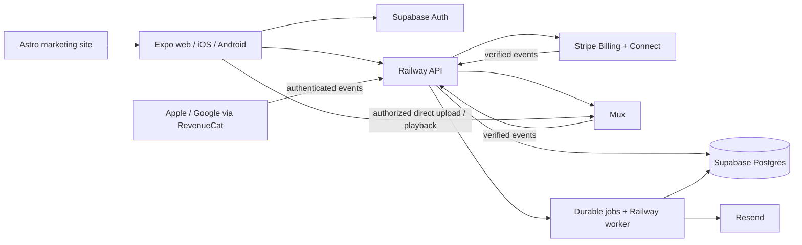

# TrainWith launch plan

Prepared September 19, 2026. Based on repository commit `5e1743e0d8090a9a0cfff3ef69ee090c09a3a103` and the Astro website in `/Users/juniper/FitME`.

**Recommendation: launch an invite-only paid web beta, then release iOS and Android. Use Railway for a TypeScript API and background worker, Supabase for authentication and Postgres, Mux for video, and Stripe Billing + Connect for web subscriptions and coach payouts.** Keep Expo and the existing website; there is no need for another frontend rewrite.

This is a proposed implementation plan, not a deployment. GitHub access and cloning are complete. Provider accounts, domain ownership, business country, budget, and store accounts have not been verified. The sequence assumes web first; the native payment feasibility work should still happen in the first week.

Companion documents: [code audit and verification](AUDIT.md), [accounts and credentials checklist](CREDENTIALS.md), and [implementation backlog](BACKLOG.md).

## 1. What is ready, and what is missing

The app has useful consumer and creator journeys: discovery, channel pages, workout playback, programs, saved workouts, memberships, a creator studio, content editing, and publishing checks. It also has a service layer, linting, TypeScript checks, domain tests, interaction tests, and successful GitHub CI.

The business is not operational yet. Sign-in records a name and email locally. Membership purchases simulate success. Payout setup sets a boolean. Videos stay on the uploading device. Support requests stay in local storage. Paid access is a client-side check. These are launch blockers, not missing API keys that can simply be pasted in.

The service layer is a good starting point, but its synchronous state transitions must become asynchronous requests with loading, error, retry, and cache behavior. Preserve the screens while adapting their data flow. Do not assume replacing `PaymentGateway` alone produces a production app.

The website currently embeds an older Expo export from the supplied ZIP. Its three example coach routes and 31 screen entry pages are a demo, not a live marketplace. Move to one canonical Expo source and one backend before public launch.

## 2. Recommended architecture and Railway decision

| Component                                 | Proposed home                             | Responsibility                                                                            |
| ----------------------------------------- | ----------------------------------------- | ----------------------------------------------------------------------------------------- |
| Marketing website                         | Cloudflare Pages, existing Astro project  | Brand, acquisition, public information, policies                                          |
| Member app and creator studio on web      | EAS Hosting, built from this repository   | Live Expo web application                                                                 |
| iOS and Android                           | Expo EAS Build / Submit / Update          | Signed native builds, releases, compatible updates                                        |
| API                                       | Railway, TypeScript/Node service          | Authorization, checkout creation, upload authorization, playback tokens, admin operations |
| Background work                           | Railway worker + scheduled reconciliation | Durable event processing, retries, email, billing reconciliation                          |
| Identity and database                     | Supabase Auth + managed Postgres          | Users, ownership, content metadata, subscriptions, access, ledger                         |
| Photos and thumbnails uploaded by coaches | Supabase Storage                          | Image storage with ownership policies                                                     |
| Workout video                             | Mux                                       | Direct upload, processing, adaptive streaming, signed playback                            |
| Web commerce                              | Stripe Checkout + Billing + Connect       | Subscriptions, onboarding, refunds, payouts                                               |
| Native purchases, if used                 | RevenueCat + Apple / Google billing       | Purchase verification and subscription lifecycle                                          |
| Transactional email                       | Resend, including SMTP for Auth           | Verification, receipts where appropriate, support acknowledgments                         |
| Error reporting                           | Sentry                                    | Client/API errors, release tracing, redacted diagnostics                                  |

Railway is a reasonable choice for this API because billing and media events need reliable processing and retries. Keep a durable event inbox/outbox in Postgres; an initial worker can use that database instead of adding Redis. Never acknowledge an event as accepted until it is durably recorded. Deploy migrations separately from replica startup.

Do not add a second production Postgres database on Railway alongside Supabase. Keep the API and database in nearby regions and use a suitable connection pool. Ordinary user requests should carry the user's identity into scoped database access; privileged credentials belong only in tightly authorized server operations and event processing.

Railway also offers database deployments and object storage, but that does not remove the work of implementing authentication or video processing. Its Hobby plan starts at $5 minimum usage and Pro at $20, with included credits and usage overages. For a business with multiple operators, budget Pro. These are not unlimited fixed-price hosting plans. [Railway pricing](https://railway.com/pricing)

A smaller alternative is Supabase functions plus EAS Hosting, omitting Railway. That can work if the team deliberately chooses an edge runtime and designs durable jobs accordingly. The hybrid above is my recommendation for this marketplace; an all-Railway custom auth/video stack creates more implementation work. EAS Hosting supports the app's current single-page output and requires a paid plan for a custom domain. [EAS Hosting](https://docs.expo.dev/eas/hosting/introduction/) · [Astro on Cloudflare](https://developers.cloudflare.com/pages/framework-guides/deploy-an-astro-site/)

Proposed URLs, subject to domain ownership: `jointrainwith.com` for marketing, `app.jointrainwith.com` for the app, and `api.jointrainwith.com` for the API. Use `app.jointrainwith.com/<handle>` as the initial canonical channel URL. Redirect existing example links deliberately; do not let creator handles collide with app or marketing routes. Confirm these domains before configuring authentication redirects or app links.

## 3. Product and commercial decisions to settle first

| Decision              | Recommended starting point                                  | Why it matters                                                                       |
| --------------------- | ----------------------------------------------------------- | ------------------------------------------------------------------------------------ |
| Launch sequence       | Paid web beta, then native release                          | Proves content, payments, and retention before store complexity                      |
| Audience              | Adults, invite-only initial coaches                         | Keeps moderation and onboarding manageable; an age policy still needs implementation |
| Initial geography     | One confirmed business market and currency                  | Payment eligibility, tax, payout methods, and store rules vary                       |
| Membership            | One monthly membership per coach; multiple coaches allowed  | Matches the existing product, affects native catalog design                          |
| Creator pricing       | A few approved price bands initially                        | Simplifies subscriptions, support, and native product setup                          |
| Platform fee          | Founder decision after unit-economics review                | Define whether fees, tax, refunds, and store commissions reduce the coach share      |
| Payout terms          | Written schedule, reserves, minimums, refund responsibility | Revenue shown in the app must match payable money                                    |
| Seller responsibility | Confirm with Stripe and business advisers                   | Determines charge type, tax handling, refunds, and liability                         |
| Creator studio        | Desktop/mobile web for initial uploading                    | Large uploads are easier to support here; native viewing remains a priority          |

Do not promise a commission percentage until web and native economics are modeled. A $20 membership is gross revenue, not $20 available to divide. Record taxes, provider fees, refunds, reserves, and coach/platform amounts separately. Obtain suitable business, tax, and fitness-content advice for the markets actually selected.

## 4. Billing: resolve this before building the wrong checkout

For the web beta, use Stripe-hosted Checkout subscriptions and Connect-hosted coach onboarding. Decide direct versus destination charges after confirming the seller model. Destination charges are a plausible fit if TrainWith takes responsibility for platform fees, refunds, and disputes; that responsibility is a business choice. [Stripe Connect subscriptions](https://docs.stripe.com/connect/subscriptions)

For native apps, these are paid on-demand digital workouts. Plan for store billing unless the chosen storefront and distribution model qualify for a specific alternative. Apple's rules include US storefront link allowances and other exceptions; a reader-app route requires assessment. Google also has regional alternative-billing/link programs. Do not assume an ordinary Stripe button is valid worldwide or that a live one-to-one coaching exception applies to recorded videos. [Apple review rules](https://developer.apple.com/app-store/review/guidelines/) · [Google payments policy](https://support.google.com/googleplay/android-developer/answer/9858738)

**Week-one native feasibility test:** configure two example coaches, allow one member to subscribe to both, restore both purchases on a second device, and map each transaction to the right coach. Apple permits only one active subscription per subscription group, so separate coach subscriptions need an appropriate group structure. Test catalog maintenance and price changes before promising unlimited self-service creator pricing. [Apple subscription design](https://developer.apple.com/app-store/subscriptions/)

RevenueCat is a candidate for native purchase verification, not the source of creator ownership or a payout system. Use the authenticated TrainWith user ID, a server-maintained product-to-coach mapping, and a unified access table for purchases from every platform. Never grant all coach libraries through one generic premium entitlement. Block accidental duplicate subscriptions across web and native; cancellation must direct the member to the original billing provider.

Apple/Google proceeds arrive through store settlement, not as Stripe Checkout charges. A separate ledger must calculate coach earnings, adjustments, and payable amounts. Confirm an eligible funding/payout arrangement for those proceeds; do not assume Stripe Connect can automatically split them. Native paid launch is gated on this operating model as well as purchase verification.

## 5. Phased delivery plan

Estimates assume one experienced full-time engineer with timely founder decisions and access to design/QA help. They are planning ranges, not delivery promises. Target roughly **6–10 weeks to a controlled paid web beta**, then **3–6 additional weeks for native release**, with some work overlapping. Account verification, content production, store testing, and review can extend this.

### Phase 0 — Ownership, architecture, and payment feasibility

Suggested window: week 1. Owners: founder + engineering.

- Confirm the decisions above, domain, legal entity, provider ownership, support contact, and budget.
- Keep `TrainWithv1` as the canonical app repository. Create a normal release branch and protect it; the current default branch is `claude/epic-bohr-totfie`. Preserve its history.
- Put the existing Astro site under version control with clear release ownership. Share brand tokens and API contracts; a monorepo migration is optional and should not block the beta.
- Establish independent preview and production data/secrets. Pin a supported Node runtime consistently with CI.
- Run the two-coach native billing experiment and document the regional purchase strategy.
- Triage dependency advisories without blindly applying suggested major downgrades.

Exit: written architecture, payment model, supported regions, account owners, and prioritized backlog; developer builds can be installed on real iOS and Android devices.

### Phase 1 — Real identity, data, and access control

Suggested window: weeks 1–3. Owner: engineering.

- Implement verified email sign-in, session restoration, sign-out, recovery, and account deletion. Use suitable secure native token storage and a reviewed browser session approach.
- Replace local-only operations with typed API queries/mutations and explicit pending/failure states. Clear per-user caches on logout and account changes.
- Create database migrations, constraints, policies, and test fixtures. No demo purchases, users, or payout flags become production records.
- Enforce unique normalized handles and creator ownership atomically in the database. Expand reserved routes and retain redirects for renamed channels.
- Ensure unauthenticated users can see only published public metadata; coaches can edit only their own content; members can see only their own private history.
- Keep billing, access, and ledger mutations server-only. Validate tokens, request schemas, object ownership, pagination, and rate limits.

Exit: two real accounts on separate devices see synchronized data, cannot access each other's private records, and cannot edit another coach's channel or grant themselves access.

### Phase 2 — Real content and protected video

Suggested window: weeks 2–4. Owners: engineering + content operations.

- Replace browser IndexedDB/device-only video storage with authorized direct uploads, progress, retry, size/duration quotas, and processing states. Start creator uploads on web; defer native background uploads if needed.
- Process signed Mux events into asset state. Link uploads to the authenticated owner and immutable workout IDs. Handle abandoned uploads, processing failures, replacements, and deletion.
- Publish only playable, approved content. Protect premium assets with signed playback and check access on the server before issuing tokens; secure thumbnails/captions too when sensitive. Make token lifetimes/refresh work for a full lesson.
- Test real HLS playback, seeking, captions, interruptions, and poor connectivity on Safari, Chrome, iPhone, and Android. Signed URLs are access control, not a guarantee against screen recording.
- Replace sample coaches and the bundled clip with approved identities, licensed images/music, real lessons, accurate durations, and useful captions.

Exit: a coach uploads on one device and an authorized member watches on another; an unauthorized account cannot obtain premium playback authorization. [Mux direct uploads](https://www.mux.com/docs/guides/upload-files-directly) · [Signed playback](https://www.mux.com/docs/guides/secure-video-playback)

### Phase 3 — Web subscriptions, access, and payouts

Suggested window: weeks 3–6. Owner: engineering; founder owns commercial terms.

- Build server-created Checkout sessions from trusted product/price records. Never accept the price or payment success asserted by the app.
- Persist verified webhook events with unique provider/event IDs; process idempotently, retry durably, and reconcile with provider state. Handle duplicates and out-of-order events.
- Derive access from authoritative paid periods, including cancellation at period end, failed renewal, recovery, refunds, disputes, and the chosen grace policy. Do not use JavaScript month arithmetic as a billing clock.
- Add customer billing management, receipts, invoices, and correct billing-origin links.
- Drive coach onboarding readiness from provider capabilities/requirements, not a button click. Block sales or payouts when the account is restricted.
- Implement an auditable ledger and provider reconciliation. Distinguish gross sales, fees, pending proceeds, available balance, and paid-out amounts in the studio.

Exit: tested purchase-to-play flow, duplicate event handling, cancellation/expiry, refund/revocation policy, and an end-to-end controlled payout. [Stripe webhook implementation](https://docs.stripe.com/webhooks)

### Phase 4 — Operations, website integration, and beta hardening

Suggested window: weeks 5–8, extending as needed. Owners: engineering + founder/operations.

- Build a restricted admin interface for coach approval, content reports, takedowns, support requests, refunds, payout exceptions, and audit logs. Require MFA for privileged access.
- Make support deliver to an actual monitored inbox or ticket system with ownership and response expectations. Add report/block controls appropriate to creator content.
- Replace website demo links with live application URLs. Drive discovery from approved data, remove the stale embedded Expo export, and verify direct links and refreshes. If SEO channel pages are required, generate/revalidate them from public data as a separate deliverable.
- Carry the new brand into native typography, icons, splash assets, empty/error screens, emails, checkout, and store listings. Verify font/image licenses.
- Replace placeholder policies with reviewed privacy, terms, creator agreement, subscription/refund, content-rights, and fitness guidance. Implement consent and retention/deletion behavior that matches those policies.
- Configure errors, uptime, upload/playback failures, webhook lag, reconciliation mismatches, and spending alerts. Redact tokens and personal/payment data from logs.
- Rehearse backup restoration and release rollback. Keep API versions backward-compatible with installed native apps. Add real browser/device tests and accessibility checks.

Exit: beta readiness gates below all pass and support ownership is explicit.

### Phase 5 — Paid beta and native distribution

Initial cohort: approximately 5–10 approved coaches and 50–100 invited members. Require a useful real library per coach (for example one free preview and at least five paid sessions); these are proposed operating targets.

Run the beta long enough to observe actual member use and at least a renewal cycle before broadly scaling. Track signup-to-first-play, checkout conversion, paid playback failures, repeat sessions, cancellations, refunds, and payout reconciliation. Separate test events from business metrics.

For native release, configure permanent app identifiers, EAS project ownership, development/preview/production profiles, signing, update channels/runtime compatibility, universal/app links, and store submission credentials. Implement approved purchase flows, restore purchases, billing management, and store notification processing. Test with a development build; native IAP cannot be validated in Expo Go. [Expo IAP guide](https://docs.expo.dev/guides/in-app-purchases/)

Prepare screenshots, support/privacy URLs, app privacy/data-safety declarations, age ratings, content reporting, account deletion, and reviewer access to working sample content. Audit SDK data collection and permissions against actual behavior. Test tablet layouts or explicitly limit support before submission.

Enroll in the appropriate developer accounts early. New personal Google Play accounts created after November 13, 2023 generally require at least 12 opted-in testers for 14 continuous days before applying for production access; this is not automatic approval. [Google testing requirements](https://support.google.com/googleplay/android-developer/answer/14151465?hl=en-GB)

## 6. Minimum data model and API surface

These are proposed entities, not an existing schema:

| Group      | Records and constraints                                                                                                                    |
| ---------- | ------------------------------------------------------------------------------------------------------------------------------------------ |
| Identity   | Auth users, profiles, role grants; immutable user IDs                                                                                      |
| Creators   | Channels, owner memberships, handle redirects; unique normalized handle                                                                    |
| Catalog    | Workouts, video assets, programs, ordered program-workout relations; explicit draft/processing/published states                            |
| Pricing    | Creator offers and versioned provider price/product mappings; integer minor units and currency                                             |
| Commerce   | Customers, subscriptions, billing events, refunds/disputes; unique external IDs and billing origin                                         |
| Access     | Per-user/per-creator grants with source, validity, status; only trusted server processes write                                             |
| Accounting | Ledger entries, transfers, payout records, reconciliation runs; preserve adjustments instead of rewriting history                          |
| Engagement | Saved programs, playback progress, workout sessions; decide whether repeat sessions should count beyond the current first-completion model |
| Operations | Support tickets, content reports, moderation actions, audit logs, durable jobs                                                             |

Proposed API groups: public catalog; authenticated profile/history; creator content CRUD; upload authorization; playback authorization; checkout/billing portal; Connect onboarding; Stripe/Mux/RevenueCat events; restricted admin operations. Publish a typed contract before wiring screens. Migrations, RLS tests, authorization tests, and environment fixtures are part of the deliverable.

## 7. Launch gates

Paid web beta must satisfy all of these:

- Two-user isolation and creator ownership tests pass against the real database/API.
- A forged membership, price, user ID, or payout flag cannot grant access or move money.
- Paid video works across devices, and denied/expired access cannot mint playback tokens.
- Purchases, duplicate webhooks, renewal failure, cancellation, refunds, and payout failures have verified behavior.
- Ledger reconciles to provider records; backup restore and operational rollback have been exercised.
- Only approved real content and valid policies are public; support and moderation routes reach an operator.
- Browser/device checks cover supported screen sizes, keyboard/screen-reader paths, and poor connectivity.
- Production data/secrets are isolated, logs are redacted, and alerts reach an accountable owner.

Native launch additionally requires the approved storefront billing design, purchase/restore/account-switch tests, correct coach attribution, store settlement-to-coach payout accounting, and accepted store submissions. CI exports are not substitutes for signed device builds.

## 8. Budget and ongoing costs

Illustrative USD planning budget checked September 19, 2026. Usage, region, taxes, plan changes, and negotiated terms can alter it.

| Service                                | Published starting point / planning allowance                                                                                                                                                                                                        |
| -------------------------------------- | ---------------------------------------------------------------------------------------------------------------------------------------------------------------------------------------------------------------------------------------------------- |
| Supabase                               | Pro starts at $25/month; additional project compute starts at $10/month. [Pricing](https://supabase.com/pricing)                                                                                                                                     |
| Railway                                | Pro minimum $20/month with usage included up to that amount; budget $20–60 initially and measure. [Pricing](https://railway.com/pricing)                                                                                                             |
| Expo EAS                               | Starter $19/month plus additional usage; free tier can serve early build experiments. [Pricing](https://expo.dev/pricing)                                                                                                                            |
| Mux                                    | Metered stored/delivered minutes; see example below. [Pricing](https://www.mux.com/pricing)                                                                                                                                                          |
| Email, monitoring, static site, domain | Reserve roughly $20–60/month initially; an allowance, not a quoted bundle                                                                                                                                                                            |
| Stripe                                 | Payment processing, Billing, Connect, and optional tax fees; quote for the business country and charge model. [Payments](https://stripe.com/pricing) · [Connect](https://stripe.com/connect/pricing) · [Billing](https://stripe.com/billing/pricing) |
| RevenueCat, when native billing starts | Free up to $2,500 monthly tracked revenue; published pricing then becomes 1% of tracked revenue. Store commissions are separate. [Pricing](https://www.revenuecat.com/pricing)                                                                       |
| Apple / Google accounts                | Apple $99/year, region-dependent; Google Play $25 one time. [Apple](https://developer.apple.com/programs/enroll/) · [Google](https://support.google.com/googleplay/android-developer/answer/6112435)                                                 |

Set an initial **$100–250/month infrastructure budget for the small beta**, excluding payment/store fees, creator earnings, taxes, engineering, legal work, and content production. This is a planning envelope, not a vendor quote or a ceiling.

Video example using Mux basic 1080p published rates: 10 coaches × 20 videos × 30 minutes = 6,000 stored minutes, approximately $18/month at $0.003 per stored minute. At 100 members × 12 sessions × 30 minutes, 36,000 delivery minutes fit within the listed 100,000 free monthly delivery minutes. At 1,000 members with the same use, 260,000 additional delivery minutes at $0.001/minute are about $260, plus storage. This simplifies credits, buffering, input options, and storage discounts; actual delivery includes preloaded/buffered video. [Mux pricing](https://www.mux.com/pricing)

## 9. What to do next

1. Confirm launch market, legal entity, domain, fee/payout policy, and web-first sequence.
2. Establish owner-controlled provider accounts from the [credentials checklist](CREDENTIALS.md), starting with Expo, Supabase, Railway, Stripe test mode, Mux, and email.
3. Build one end-to-end staging flow: verified sign-in → approved coach upload → test subscription → server-authorized playback → cancellation → access expiry.
4. Complete the native two-coach purchase experiment before scaling creator onboarding.
5. Expand that proven flow through the [backlog](BACKLOG.md), then run the beta readiness checks.

Defer live classes, chat, AI coaching, wearables, social feeds, affiliates, annual plans, offline video downloads, and multiple currencies until the paid membership and content operation is reliable. No OpenAI API key is required for this launch scope.
